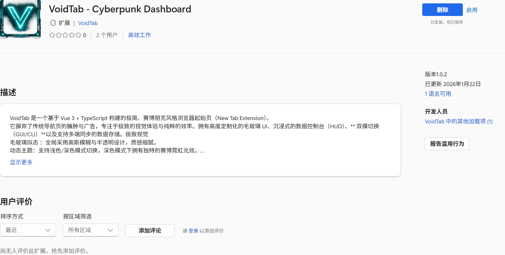
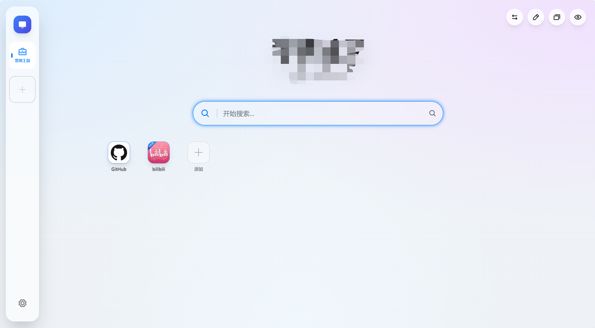

# VoidTab

[English](./README.en.md) | 简体中文

[](./CHANGELOG.md)
[](https://vuejs.org)
[](https://vitejs.dev)
[](https://www.typescriptlang.org)
[](./LICENSE)
[](https://www.flycode.icu)

VoidTab 是一个基于 Vue 3、TypeScript 和 Manifest V3 构建的浏览器新标签页扩展。它把快捷访问、聚合搜索、小组件、主题系统、终端模式和 WebDAV 同步整合到一个轻量、可定制的赛博朋克风格工作台里。



## 文档导航

- [English README](./README.en.md)
- [更新日志](./CHANGELOG.md)
- [Edge 商店](https://microsoftedge.microsoft.com/addons/detail/voidtab-cyberpunk-dashb/apddbplmmpiiocfilhceiopjcjpkcbdj?hl=zh-CN)
- [Releases](https://github.com/flycodeu/VoidTab/releases)

## 核心特性

- **沉浸式界面**：毛玻璃 UI、深浅色主题、赛博霓虹效果、网络图片/必应每日壁纸/本地图片或视频背景。
- **快捷访问管理**：支持分组、拖拽排序、站点自动图标、书签 HTML 导入和右键菜单。
- **聚合搜索**：内置 Google、Bing、Baidu 等搜索引擎，支持自定义搜索源与历史记录。
- **终端模式**：提供 GUI/CLI 双模切换、命令输入、历史记录和自动补全体验。
- **组件生态**：内置天气、日历、倒计时、Cron、GitHub Trending、股票、系统监控、JWT、Base64、照片墙、小游戏等组件。
- **数据同步**：支持 WebDAV，同步配置、分组、站点和用户偏好，适配坚果云、Nextcloud 等服务。
- **AI 助手**：内置 AI 对话面板，可配置兼容接口，在新标签页内快速调用。



## 安装方式

### Edge 商店安装

在 Edge 商店搜索 `VoidTab`，或直接打开：

[VoidTab - Edge 商店](https://microsoftedge.microsoft.com/addons/detail/voidtab-cyberpunk-dashb/apddbplmmpiiocfilhceiopjcjpkcbdj?hl=zh-CN)

商店版本安装方便并支持自动更新，但更新会受到商店审核时间影响。

### 手动安装扩展

1. 从 [Releases](https://github.com/flycodeu/VoidTab/releases) 下载最新版本。
2. 解压构建包。
3. 打开 `chrome://extensions/` 或 `edge://extensions/`。
4. 启用 `Developer mode` / `开发者模式`。
5. 点击 `Load unpacked` / `加载已解压的扩展程序`。
6. 选择解压后的 `dist` 目录。

### 从源码构建

```bash
git clone https://github.com/flycodeu/VoidTab.git
cd VoidTab
npm install
npm run build
```

构建完成后，扩展产物会生成在 `dist/`。

## 本地开发

```bash
npm install
npm run dev
```

开发服务器默认运行在 `http://localhost:5173`。网页开发模式适合调试 UI，但部分 Chrome Extension API、Chrome Storage 同步和跨域能力需要在扩展环境中验证。

常用命令：

```bash
npm run test
npm run typecheck
npm run build:web
npm run build:ext
npm run build
```

## 项目结构

```text
src/
├── app/shell/                 # 应用外壳、壁纸层、品牌元素
├── core/                      # 配置、存储、同步、主题和注册中心
├── features/                  # 业务功能模块
│   ├── ai/                    # AI 对话面板
│   ├── context-menu/          # 全局右键菜单
│   ├── home/                  # 首页网格和站点卡片
│   ├── navigation/            # 侧边栏、顶部操作和移动端分组导航
│   ├── settings/              # 设置面板
│   ├── teminal/               # 终端模式组件，目录名沿用历史拼写
│   └── widgets/               # 内置组件和组件市场
├── shared/                    # 通用 UI、图标、组合式函数、工具和类型
└── stores/                    # Pinia 状态管理
```

## 添加新组件

1. 在 `src/features/widgets/builtins/` 下创建组件目录，例如 `todo/`。
2. 编写 `TodoWidget.vue`，如需配置面板可添加 `TodoModal.vue`。
3. 在 `src/core/registry/widgets.ts` 注册组件元数据。
4. 在配置类型中补充必要字段，通常位于 `src/core/config/types.ts`。
5. 运行 `npm run test` 和 `npm run typecheck` 验证变更。

## 技术栈

- Vue 3 + Composition API
- TypeScript
- Vite 5
- Manifest V3
- Tailwind CSS
- Pinia
- IndexedDB
- Chrome Storage API
- WebDAV
- Phosphor Icons

## 隐私与数据

VoidTab 的配置默认保存在浏览器本地。启用 WebDAV 后，配置会同步到用户指定的 WebDAV 服务。AI、WebDAV 等敏感字段会在本地存储前进行保护处理，同步载荷会剥离敏感信息。第三方接口能力仅在相应组件启用时使用。

## 致谢

- 感谢 Google Gemini 和 ChatGPT 对代码生成、重构和文档整理的帮助。
- 感谢 Open-Meteo 提供免费天气数据服务。
- 感谢 Phosphor Icons 提供图标库。

## 许可证

本项目基于 [MIT License](./LICENSE) 开源。
