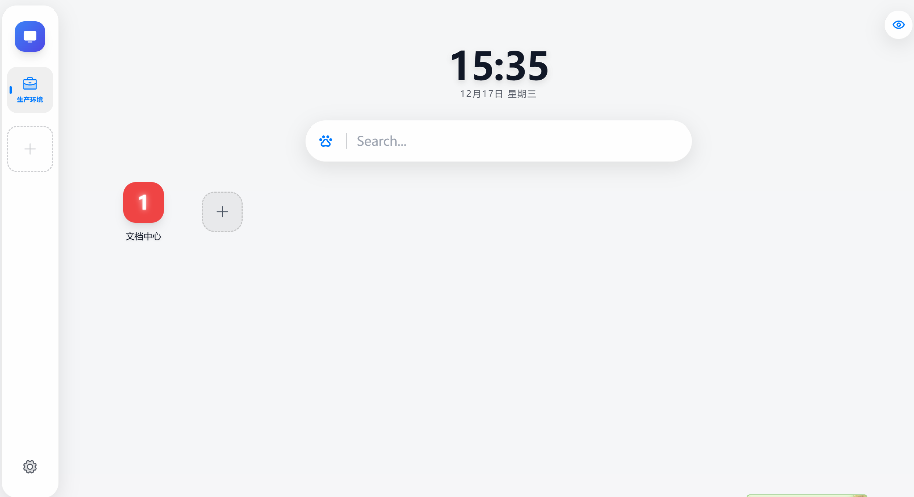

# ✨ Vue Glassmorphism Start Page (仿 iTab/iOS 风格起始页)

一个基于 **Vue 3 + TypeScript + Vite + Tailwind CSS** 构建的高颜值、高自定义程度的浏览器起始页。
采用类 iOS/visionOS 的磨砂玻璃拟态设计 (Glassmorphism)，支持深色/浅色模式智能切换、拖拽布局、完全的样式自定义以及本地数据隐私保护。

## 🚀 功能特性

* **🎨 极致 UI 设计**：
    * 支持 **深色 (Dark)** / **浅色 (Light)** 模式，智能反色，文字在任何背景下均清晰可见。
    * 高级磨砂玻璃质感 (Glassmorphism)，支持模糊度、遮罩浓度自定义。
* **🛠️ 高度自定义**：
    * **布局**：图标大小、圆角、网格间距、侧边栏位置 (左/右) 均可调节。
    * **壁纸**：支持网络图片 URL 或 **本地图片上传** (Base64 存储)。
    * **内容**：图标拖拽排序 (Drag & Drop)、右键编辑、添加/删除分组。
* **🔍 搜索引擎管理**：
    * 支持自定义搜索引擎 (Google, Baidu, Bing 等)。
    * 快捷切换引擎，支持删除和新增。
* **🧘 专注模式**：
    * 一键隐藏所有杂项，仅保留壁纸与搜索框，提供沉浸式体验。
* **🔒 数据隐私**：
    * 所有数据存储在浏览器本地 (**LocalStorage**)，无后端交互，安全隐私。

## 🛠️ 技术栈

* **框架**: [Vue 3](https://vuejs.org/) (Composition API)
* **构建工具**: [Vite](https://vitejs.dev/)
* **语言**: [TypeScript](https://www.typescriptlang.org/)
* **样式**: [Tailwind CSS](https://tailwindcss.com/)
* **状态管理**: [Pinia](https://pinia.vuejs.org/) + [pinia-plugin-persistedstate](https://prazdevs.github.io/pinia-plugin-persistedstate/)
* **图标库**: [Phosphor Icons](https://phosphoricons.com/)
* **拖拽库**: [VueDraggablePlus](https://vue-draggable-plus.pages.dev/)
* **工具库**: [VueUse](https://vueuse.org/)

## ⚡️ 快速开始

### 1. 环境准备
确保你的环境中有 [Node.js](https://nodejs.org/) (推荐 v16+)。

### 2. 安装依赖

```bash
# 使用 npm
npm install
```
## 3. 启动开发服务器
```bash
npm run dev
```
打开浏览器访问 http://localhost:5173 即可看到效果。

## 4. 打包部署
```bash
npm run build
```
打包生成的文件位于 dist 目录，可部署到任何静态服务器 (如 Vercel, Netlify, GitHub Pages, Nginx)。


# 📂 项目结构说明 
```
src/
├── assets/              # 静态资源
├── components/          # UI 组件
│   ├── layout/          # 布局组件 (如 MainGrid.vue 网格布局)
│   └── ui/              # 基础组件 (GlassCard.vue, SiteDialog.vue, ContextMenu.vue 等)
├── composables/         # 组合式函数 (useTheme.ts 负责 CSS 变量绑定)
├── stores/              # 状态管理 (Pinia)
│   └── useConfigStore.ts # 核心配置：默认网站、搜索引擎、主题设置都在这里
├── types/               # TypeScript 类型定义
├── App.vue              # 根组件 (侧边栏、搜索框、设置面板逻辑)
├── main.ts              # 入口文件
└── style.css            # 全局样式 & CSS 变量 (深浅模式配色)
```


# 📝 常见修改指南
## 1. 修改默认显示的网站和分组
   打开 src/stores/useConfigStore.ts，找到 defaultConfig 对象。 修改 layout 数组即可调整默认初始化的网站数据。
```vue
// src/stores/useConfigStore.ts
layout: [
  {
    id: 'g-1',
    title: '生产环境',
    icon: 'Briefcase', // Phosphor 图标名
    items: [
      { 
        id: '1', 
        title: '文档中心', 
        url: 'https://...', 
        iconType: 'text', // 'text' 或 'icon'
        iconValue: '文',  // 文字或图标名
        bgColor: '#ef4444' 
      },
      // ...
    ]
  }
]
```
## 2. 修改默认搜索引擎
   同样在 src/stores/useConfigStore.ts 中，找到 defaultEngines 数组进行增删。

## 3. 修改配色方案 (深色/浅色模式)
   打开 src/style.css。
   - :root { ... } 定义了 深色模式 的默认变量。 
   - html.light { ... } 定义了 浅色模式 的覆盖变量。 
   - 关键变量： 
     - --text-primary: 主文字颜色。 
     - --bg-overlay: 背景遮罩渐变。 
     - --glass-surface: 玻璃卡片背景色。

## 4. 解决“图标不显示”问题
   本项目使用 Phosphor Icons。

在配置文件中引用图标时，使用图标的 PascalCase 名称（例如 Globe, GithubLogo, Monitor）。

代码会自动处理 Ph 前缀，所以你只需要填核心名字。

# 🤝 贡献 (Contributing)
欢迎提交 Issue 或 Pull Request 来改进这个项目！
