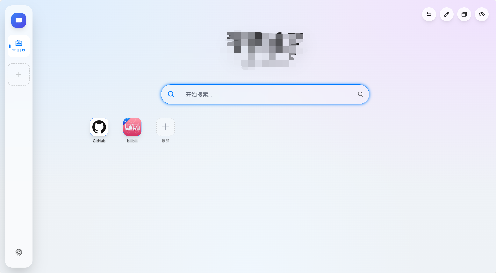
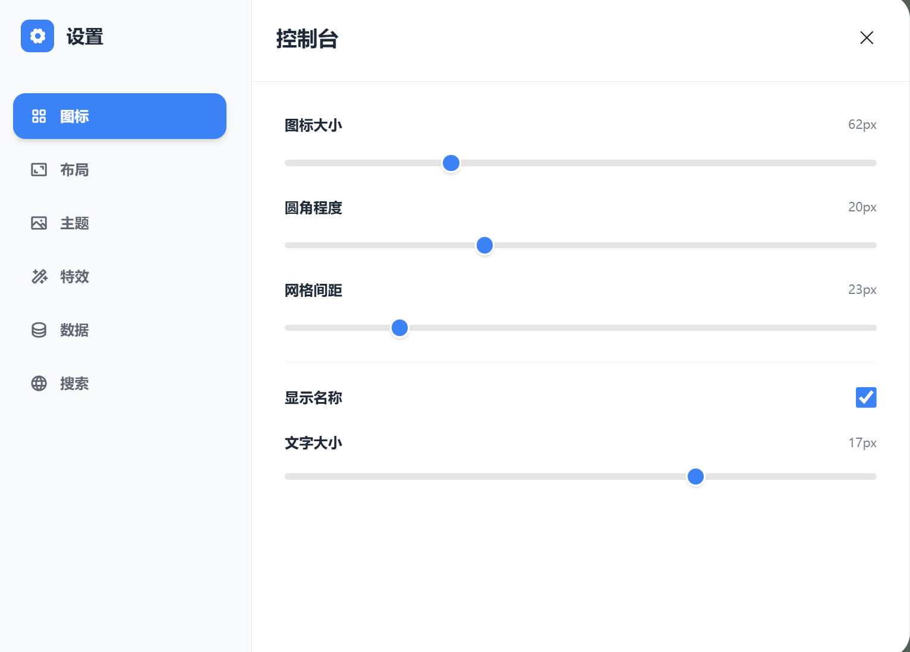
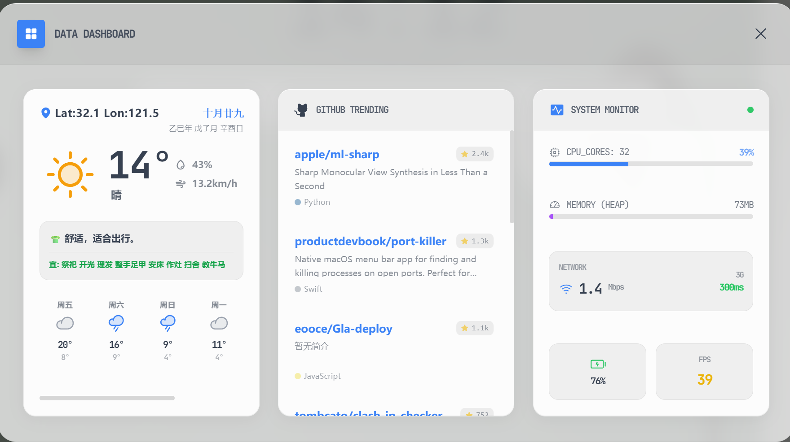
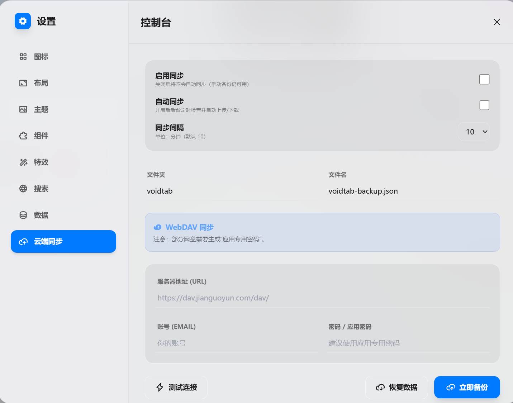
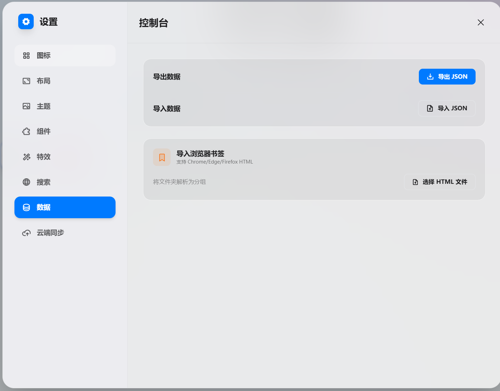
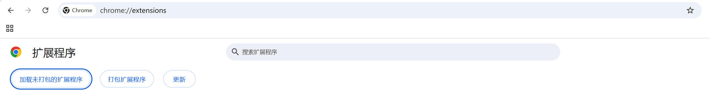
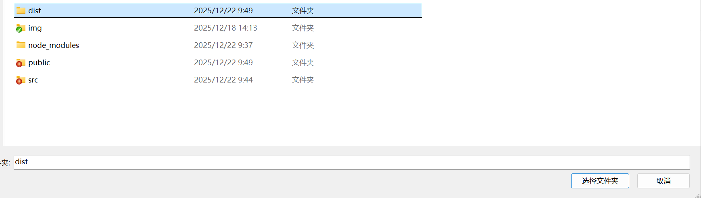
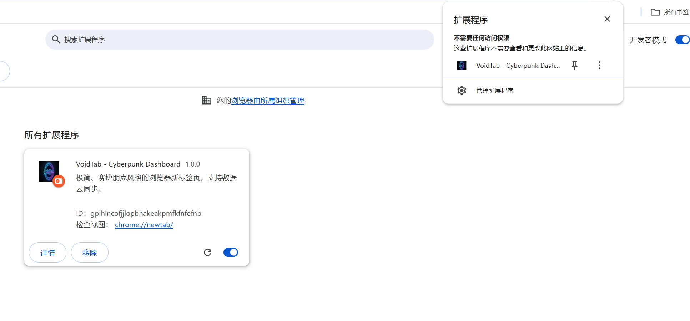

**# 🌌 VoidTab - Cyberpunk Browser Dashboard


**VoidTab** 是一个基于 **Vue 3 + TypeScript** 构建的极简、赛博朋克风格浏览器起始页（New Tab Extension）。

它摒弃了传统导航页的臃肿与广告，专注于**极致的视觉体验**与**纯粹的效率**。拥有高度定制化的毛玻璃 UI、沉浸式的数据控制台（HUD）以及支持多端同步的数据存储。


> 🤖 **Fun Fact:** 本项目 99% 的代码由 AI (Google Gemini) 辅助编写，是一个探索 AI 辅助独立开发的实验性项目。

---

## ✨ 功能特性 (Features)

### 🎨 极致视觉
* **毛玻璃拟态 (Glassmorphism)**：全局采用高斯模糊与半透明设计，质感细腻。
* **动态主题**：支持浅色/深色模式切换，深色模式下拥有独特的赛博霓虹光效。
* **自定义壁纸**：支持配置网络图片链接、必应每日壁纸，或上传本地视频/图片作为背景。
* **布局切换**：支持左侧边栏/右侧边栏布局一键切换。



### 🕹️ 战术控制台 (Data HUD)
通过右上角按钮（或快捷键）呼出沉浸式仪表盘：
* **🌤️ 天气气象站**：自动定位，提供实时温度、湿度、风速及未来 7 天预报，内置中国农历与宜忌查询。
* **📈 GitHub 趋势**：实时获取 GitHub 热门开源项目，展示 Star 数与语言分布，点击直达。
* **🖥️ 系统监控**：浏览器级硬件监控，实时显示 FPS、CPU 核心数、内存占用估算及网络延迟。
* **📰 RSS 聚合**：支持自定义 RSS 订阅源，以卡片流形式展示最新资讯。




### ⚡ 高效交互与同步
* **☁️ WebDAV 同步**：支持坚果云、Nextcloud 等 WebDAV 协议网盘，实现跨设备、跨浏览器的数据全量同步。
* **📚 书签导入**：支持从 Chrome/Edge 导出的 HTML 书签文件一键导入，自动解析文件夹为分组。
* **📁 拖拽管理**：支持分组排序、图标跨分组拖拽，完全自定义你的工作台。
* **🔍 聚合搜索**：内置多种搜索引擎（Google, Bing, Baidu 等），支持自定义添加。
* **专注模式 (Focus Mode)**：一键隐藏所有杂项，仅保留时间与搜索框，提供极致的沉浸式体验。


---

## 🚀 安装与使用 (Installation)

本项目支持两种运行模式：**浏览器插件模式**（推荐）和 **网页开发模式**。

### 方式一：作为浏览器插件安装 (推荐)
想要获得最佳体验（包括新标签页接管、跨设备同步），请按此步骤安装：

1.  **克隆并构建**
    ```bash
    git clone [https://github.com/flycodeu/VoidTab.git](https://github.com/flycodeu/VoidTab.git)
    cd VoidTab
    npm install
    npm run build
    ```
    *构建完成后，根目录会生成一个 `dist` 文件夹。*

2.  **加载到 Chrome / Edge**
* 在地址栏输入 `chrome://extensions/` (Chrome) 或 `edge://extensions/` (Edge)。
* 打开右上角的 **开发者模式 (Developer mode)**。
* 点击 **加载已解压的扩展程序 (Load unpacked)**。
* 选择项目根目录下的 `dist` 文件夹。
* 打开一个新的标签页，即可体验 VoidTab。

### 方式二：本地网页开发
如果你想贡献代码或调试 UI：

1.  **启动开发服务器**
    ```bash
    npm run dev
    ```
2.  **访问预览**
    浏览器访问 `http://localhost:5173` 即可看到效果。
    *(注：网页模式下无法测试 Chrome Storage 同步及部分跨域 API 功能)*。

---

## 💻 二次开发指南 (Development Guide)

VoidTab 采用了模块化架构，逻辑层与视图层分离，方便扩展。

### 1. 核心架构说明
* **View Layer (`src/components`)**: 负责 UI 展示。
    * `layout/`: 页面整体布局组件（侧边栏、主网格、壁纸层）。
    * `widgets/`: 功能性小组件（天气、GitHub 榜单等）。
    * `settings/`: 设置面板的各个 Tab 页。
    * `ui/`: 通用的原子组件（弹窗、右键菜单、确认框）。
* **Logic Layer (`src/core`)**: 核心业务逻辑，不依赖具体 UI。
    * `config/`: 配置管理，定义了整个应用的数据结构。
    * `storage/`: 存储适配器模式，自动判断环境使用 `chrome.storage` 或 `localStorage`。
    * `sync/`: WebDAV 同步服务的核心实现。
    * `theme/`: 壁纸与主题的管理逻辑。
* **State Management (`src/stores`)**: 使用 Pinia 管理全局响应式状态。

### 2. 如何添加一个新的小组件 (Widget)?
假设你要添加一个“待办事项”组件：

1.  **创建组件文件**: 在 `src/components/widgets/` 下新建 `TodoWidget.vue`。
2.  **注册组件**:
    * 在 `src/components/layout/WidgetPanel.vue` 中引入该组件。
    * 在 `src/core/config/types.ts` 中的 `WidgetConfig` 类型里添加新的组件 ID。
    * 在 `src/core/config/default.ts` 中设置默认启用状态。
3.  **开发逻辑**: 组件内部可以自由调用 `useConfigStore` 获取或保存数据。

### 3. 如何修改同步逻辑?
同步相关的核心代码位于 `src/core/sync/`：
* `service.ts`: 负责调度同步任务（自动/手动）。
* `transport.ts`: 定义了数据传输的接口。
* `providers/webdav.ts`: WebDAV 协议的具体实现。
* 如果你想支持 S3 或 GitHub Gist 同步，只需在 `providers/` 下新增适配器并实现 `SyncProvider` 接口即可。

### 4. 样式定制
项目使用 Tailwind CSS，全局样式变量定义在 `src/style.css` 中。你可以修改 `:root` 下的变量来快速调整主题色、圆角大小和毛玻璃模糊度。

---

## 🖼️ 截图预览 (Gallery)

| 设置面板 | 分组管理 | 编辑模式 |
| :---: | :---: | :---: |
|  |  |  |

---

## 🛠️ 技术栈 (Tech Stack)

* **Core**: Vue 3 (Composition API)
* **Build**: Vite 5.x
* **Extension**: Manifest V3 + Chrome Storage API
* **Language**: TypeScript
* **Styling**: Tailwind CSS
* **State**: Pinia
* **Icons**: Phosphor Icons
* **Utils**: VueUse, Lunar-javascript
* **Network**: Fetch API (WebDAV)

---

## 📂 项目结构

```text
├── src
│   ├── components       # 视图层：所有 Vue 组件
│   │   ├── layout       # 布局组件 (HomeMain, SideBar, WidgetPanel)
│   │   ├── settings     # 设置面板各个 Tab 页
│   │   ├── ui           # 通用 UI 组件 (Dialog, ContextMenu)
│   │   └── widgets      # 桌面小组件 (Weather, GitHub, RSS)
│   ├── composables      # 组合式函数 (Hooks)
│   ├── core             # 核心逻辑层 (与 UI 解耦)
│   │   ├── config       # 配置管理与类型定义
│   │   ├── registry     # 图标与静态资源注册
│   │   ├── storage      # 存储适配器 (Chrome/Local)
│   │   ├── sync         # 同步引擎核心 (WebDAV)
│   │   └── theme        # 主题与壁纸逻辑
│   ├── stores           # Pinia 状态管理
│   ├── utils            # 工具函数 (书签解析, 图标处理)
│   └── types            # 全局类型定义
```
## ❤️ 致谢 (Credits)
- 感谢 Google Gemini 、ChatGpt提供强大的代码生成与重构支持。
- 感谢 Open-Meteo 提供免费且无需 Key 的天气 API 服务。
- 感谢 Phosphor Icons 提供精美的图标库。
